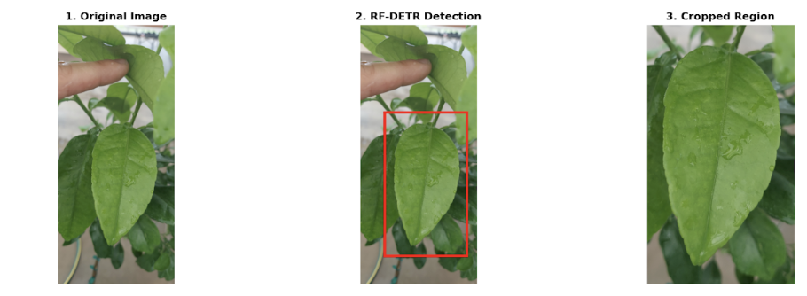
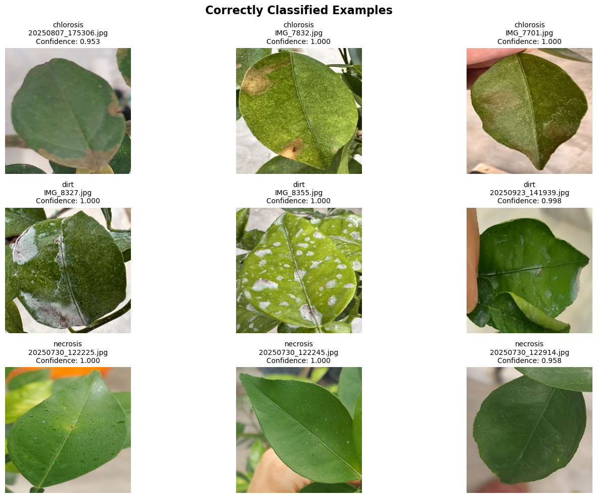

# AGAI — Automated Grape Anomaly Identification

A two-stage deep learning pipeline for single-leaf classification across five agronomic anomaly categories: **necrosis**, **chlorosis**, **residue**, **dirt**, and **water**.

---

## Overview

Accurately classifying leaf conditions in field images is challenging due to scene complexity — images often contain multiple overlapping leaves, variable lighting, and cluttered backgrounds. AGAI addresses this with a two-stage architecture:

1. **Detection** — [RF-DETR](https://github.com/roboflow/rf-detr) localizes and isolates the most prominent leaf in each image via bounding box prediction.
2. **Classification** — The cropped leaf region is passed to a **FastViT + MLP** classifier, which predicts one of five anomaly classes.

This decomposition simplifies the classification task significantly, isolating the region of interest before inference and improving overall accuracy.

---

## Pipeline

### Stage 1 — Leaf Detection (RF-DETR)

RF-DETR identifies the most prominent leaf in each input image and outputs a bounding box. The image is then cropped using that bounding box with an additional **100px padding**, and resized to **256×256 pixels** before being passed to the classifier.

  

### Stage 2 — Anomaly Classification (FastViT + MLP)

The preprocessed 256×256 crop is fed into a FastViT backbone with an MLP classification head, which predicts the leaf's anomaly class.

  

---

## Dataset & Training

> **Data access:** The dataset used in this research is not publicly available. Please contact the author directly to request access.

### Statistics

| Split | Images per Class | Total Images |
|---|---|---|
| Training | 294 | 1,470 |
| Validation | 63 | 315 |
| Testing | 63 | 315 |
| **Total** | **420** | **2,100** |

- **5 classes:** necrosis, chlorosis, residue, dirt, water
- **4,200 total images** across all splits
- **Data split:** 70 / 15 / 15 (train / val / test)
- **Test accuracy:** 99%

All training images were preprocessed using the RF-DETR cropping and resizing pipeline described above before being used to train the FastViT + MLP classifier.

---

## Notebooks

### RF-DETR Fine-Tuning

RF-DETR was fine-tuned on approximately **200 annotated leaf images**. This detection dataset is also not publicly available — please contact the author to request access.

---

## Notebooks

| Notebook | Description |
|---|---|
| `Final_Training_FastViT.ipynb` | Training pipeline for the FastViT + MLP classifier. Operates on pre-cropped images output by RF-DETR. |
| `rf-detr.ipynb` | Training pipeline for the RF-DETR object detection model. |

---

## Model Weights

The provided classifier weights correspond to the best-performing checkpoint from the 70/15/15 split trial, achieving **99% accuracy** on the held-out test set.

To request the model weights for either the **FastViT + MLP classifier** or the **RF-DETR detector**, please contact the author directly.
